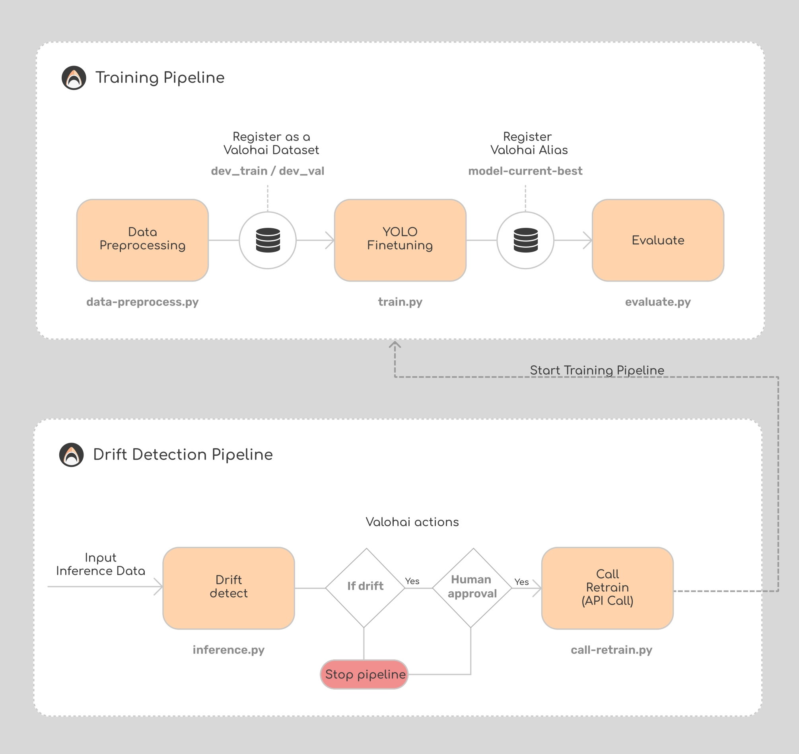

#  Drift Detection Demo using WhyLabs

**Expected Demo Time: 6-8min**

This demo illustrates the process of detecting data drift in a computer vision project using WhyLabs.

## When to use this demo?

This demo is perfect when:

* The customer aims to incorporate drift monitoring into their project.
* The customer currently utilizes monitoring tools but is unsure whether integration into Valohai is feasible.

### When NOT to use this demo?

This demo is not suitable when:

* The customer has no interest in Drift Detection.

## Video

## How to demo?

> We have an existing project that's connected to the right Git repository and allows you to demo this easily.

### Before the demo:
Create a new Valohai project and connect it the [valohai-llms](https://github.com/SofiaChar/valohai-drift-detection) repository.
You can also use [this project](https://app.valohai.com/p/SharkOrg/drift-detection-demo/)

#### Overview:
We are detecting data drift using WhyLabs in the computer vision project.

The repo consists of two pipelines:
* Training pipeline:
  - Data Preprocessing:
    - Load and prep the data
    - Save to Valohai datasets
  - YOLO finetuning:
    - Train yolo
    - Save best model with Valohai alias.
  - Evaluation:
    - Load and evaluate the model
    - Save the results to Valohai
  
* Draft detection pipeline:
  - Drift detection:
    - Load and inference the model
    - Log the data to WhyLabs 
    - Generate summary drift report with WhyLabs in html (`summary_drift_report.html`) 
    - If drift is detected, change Status detail.
    - if drift is not detected, then the pipeline is stopped ([Valohai actions docs](https://docs.valohai.com/hc/en-us/articles/18704272477841-Conditions), see `valohai.yaml` -> `drift-detection-pipeline`)
  - Call retrain
    - Only if on the previous step the drift was detected, the node starts.
    - When the node is starting it will require human approval ([Valohai actions docs](https://docs.valohai.com/hc/en-us/articles/18704272477841-Conditions))
    - If approved, API call to start the `Training Pipeline` - retrain the model because the drift was detected.
  
Overall flow of the project:

### Demo :popcorn:

We are fine-tuning YOLOv8 model with aerial images of the ships.

1. Open the pinned competed Training pipeline.
2. Go through the nodes, say what they do:
   - Preprocess: unpacks zip file and save the image data and the labels to Valohai dataset
   - Train: Gets the dataset as an inputs, performs the fine-tunning of the YOLOv8 using training dataset
   - Evaluate: evaluates the model
3. Go to pipelines -> Create pipeline -> drift-detection-pipeline -> Create
4. For the `drift-detect` node:
  - Mention that here we will use the WhyLabs to detect the drift.
  - Show the inputs of the node: it has the `data` and `ref_data`:
    - For drift detection we require not only the inference data, but also the reference data which is used to compare difference feature of these sets and notice if new data(inference) is any difference than the old data(train/val).
  - Show the env variable of the node. 
    - Mention that the secret API keys were defined for the whole project in project Settings.
      - WHYLABS_API_KEY - needed to be able to log to WhyLabs
      - VALOHAI_API_TOKEN - needed to make API calls
    - WHYLABS_DEFAULT_DATASET_ID and WHYLABS_DEFAULT_ORG_ID were defined in valohai.yaml
  - Show the actions:
    - When the node is completed if drift==0 (drift not detected) we stop the pipeline.
5. For the `call-retrain` node:
  - Show the actions:
    - When node is starting require human approval.
6. Create the pipeline
7. When the `drift-detect` node is completed:
   - Go to `drift-detect` outputs -> find `summary_drift_report.html` -> download -> open -> show that for most of the features we got the Drift
8. Approve the human approval for the `call-retrain`.
9. Show that `Training Pipeline` have started.

## FAQ?
